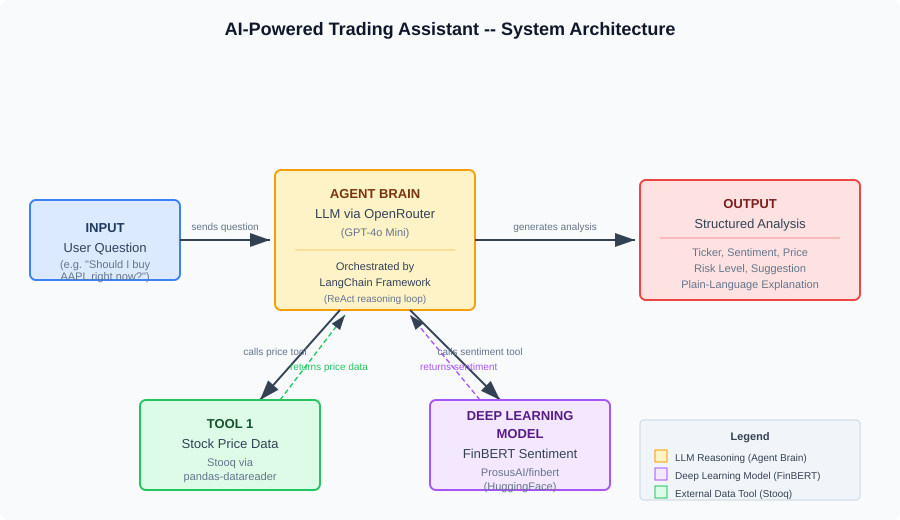

# AI-Powered Trading Assistant

A single AI agent that combines a FinBERT deep learning sentiment classifier with an LLM reasoning brain to analyze stocks and deliver structured investment guidance for beginner investors.

**Solo Project -- Javon Darby**
Houston City College | ITAI 2376 -- Deep Learning in Artificial Intelligence | Spring 2026

---

## Option Chosen

**Option A: Single AI Agent.** This is the same option selected in the Midterm blueprint. A single agent with two tools is the right fit for this problem because the workflow -- analyzing one stock at a time using price data and news sentiment -- does not require multiple agents with distinct roles.

---

## Problem Statement

Beginner investors often lack the tools and experience to evaluate whether a stock is worth buying, holding, or selling. They need to consider both recent price trends and the tone of current financial news, but doing this manually is time-consuming and subjective. This agent automates that analysis by combining a deep learning sentiment classifier with real-time price data, then synthesizing a plain-language recommendation that a non-expert can understand.

**Target user:** A beginner investor who wants a quick, structured overview of a stock before making a decision.

---

## Architecture Overview

The system has three cooperating layers. The user submits a plain-language question. LangChain routes it to the LLM (GPT-4o Mini via OpenRouter), which decides to call both tools. Tool 1 fetches recent stock price data from Stooq. Tool 2 runs FinBERT sentiment classification on financial headlines. Both structured results are returned to the LLM, which reasons over them and produces a formatted analysis with a risk level, suggestion, and explanation.



---

## Two AI Components (Deep Learning Connection)

This project intentionally separates two distinct AI roles to demonstrate deep learning concepts from the course:

**FinBERT (Deep Learning -- Classification, Module 05: Transformers)**
FinBERT is a BERT-based transformer fine-tuned on financial news corpora by ProsusAI. It classifies text as Positive, Negative, or Neutral with a confidence score. FinBERT does not reason, plan, or generate language. It handles one task: sentiment classification of financial headlines. This demonstrates how pre-trained transformer models can be applied to domain-specific NLP tasks without additional fine-tuning.

**LLM Agent Brain (Reasoning -- Generation, Module 10: Agentic AI)**
The large language model (GPT-4o Mini, hosted on OpenRouter) serves as the reasoning engine of the agent. It receives structured outputs from both tools, determines risk level, and generates a plain-language explanation. The LLM does not perform sentiment classification -- that is FinBERT's role. This demonstrates the agentic AI pattern where an LLM orchestrates tools and synthesizes information.

---

## Frameworks and Tools

- **LangChain** -- agent orchestration, tool-calling interface, ReAct reasoning loop
- **OpenRouter** -- LLM provider (GPT-4o Mini via OpenAI-compatible API)
- **HuggingFace Transformers** -- FinBERT deep learning model (ProsusAI/finbert)
- **pandas-datareader** -- stock price data via Stooq (free, no API key)
- **Python 3.11** -- runtime environment
- **Google Colab** -- recommended execution environment

---

## Installation and Setup

### Prerequisites

- Python 3.11 or later
- A free OpenRouter API key (no credit card required) from https://openrouter.ai

### Running in Google Colab (Recommended)

1. Open Google Colab at https://colab.research.google.com
2. Upload `agent.ipynb` from this repository.
3. Run all cells in order from top to bottom.
4. The first code cell installs all dependencies automatically.
5. When prompted, enter your OpenRouter API key using the secure input field.
6. Continue running cells to load FinBERT, test the tools, build the agent, and execute a full analysis.

No local Python installation is needed when using Colab.

### Running Locally

1. Clone this repository:
   ```
   git clone https://github.com/YOUR_USERNAME/JavonDarby_Solo_ITAI2376.git
   cd JavonDarby_Solo_ITAI2376
   ```

2. Create and activate a virtual environment:
   ```
   python -m venv venv
   venv\Scripts\activate        # Windows
   source venv/bin/activate     # macOS / Linux
   ```

3. Install dependencies:
   ```
   pip install -r requirements.txt
   ```

4. Copy the environment template and add your API key:
   ```
   cp .env.example .env
   ```
   Then edit `.env` and paste your OpenRouter API key.

5. Launch Jupyter and open the notebook:
   ```
   pip install jupyter
   jupyter notebook agent.ipynb
   ```

6. Run all cells in order. Enter your OpenRouter API key when prompted.

---

## How to Run the Agent

Open `agent.ipynb` and run all cells from top to bottom. The final two cells demonstrate the agent:

- **Cell 16** runs a pre-loaded test query: "Should I buy AAPL right now? Give me a full analysis."
- **Cell 18** prompts for any custom question via an interactive input field.

---

## Example Usage

**Example 1: AAPL Buy Analysis**

Input: "Should I buy AAPL right now? Give me a full analysis."

Output:
```
Ticker:           AAPL
News Sentiment:   Positive (90.28% confidence)
Price Trend:      Up 1.82% over the last 5 trading days
Risk Level:       Medium
Suggestion:       Buy
Explanation:      AAPL's stock has shown a positive price trend, increasing by
                  1.82% over the last week, which indicates a favorable market
                  response. Additionally, the news sentiment around AAPL is
                  positive with a high confidence level of 90.28%, suggesting
                  that recent news is likely to support further price growth.

Remember, this is an educational tool and not professional financial advice.
```

**Example 2: TSLA Risk Assessment**

Input: "Is it a good time to buy TSLA right now?"

Output:
```
Ticker:           TSLA
News Sentiment:   Neutral (76.06% confidence)
Price Trend:      Up 1.82% over the last 5 trading days
Risk Level:       Medium
Suggestion:       Hold
Explanation:      TSLA has seen a slight price increase of 1.82% over the last
                  week, indicating a modest upward trend. However, the news
                  sentiment is neutral, suggesting mixed feelings in the market
                  about the stock. Given these factors, it may be wise to hold
                  off on buying for now and observe how the situation develops.

Remember, this is an educational tool and not professional financial advice.
```

**Example 3: Risk Level Query**

Input: "What is the current risk level for AAPL?"

The agent calls both tools and returns the same structured format, with the risk level determined by combining the sentiment score and price trend data.

---

## Project Structure

```
JavonDarby_Solo_ITAI2376/
|-- agent.ipynb              # Main notebook (runs in Colab)
|-- README.md                # This file
|-- REFLECTION.md            # Project reflection document
|-- requirements.txt         # Python dependencies with versions
|-- .env.example             # Environment variable template
|-- .gitignore               # Git ignore rules
|-- agent/                   # Standalone Python modules
|   |-- __init__.py          # Package marker
|   |-- sentiment.py         # FinBERT sentiment module
|   |-- tools.py             # Stock price and headline tools
|   |-- agent.py             # LangChain agent assembly
|-- data/                    # Knowledge base files
|   |-- sample_headlines.json    # Pre-collected financial headlines
|-- demo/                    # Demo video folder
|   |-- README.md            # Instructions for demo placement
|-- docs/                    # Documentation assets
|   |-- architecture.svg     # Architecture diagram
```

---

## Known Limitations

- **Limited ticker support.** The sample headline set only covers AAPL and TSLA. Unsupported tickers fall back to AAPL headlines, which reduces the accuracy of sentiment analysis for other stocks.
- **Static headlines.** Headlines are pre-collected samples, not live news. In a production system these would be fetched from a financial news API.
- **Stooq reliability.** The Stooq data source occasionally returns empty responses, particularly from cloud environments like Colab. The fallback mechanism keeps the agent functional but returns static sample data in those cases.
- **No persistent memory.** The agent does not retain context between queries. Each question is processed independently.
- **Educational scope.** The agent's recommendations are based on a simplified analysis model and should not be used for real investment decisions.

---

## Demo

The demo video is located in the `demo/` folder of this repository.

<!-- Update the link below once the demo video is added -->
<!-- [Watch the Demo](demo/JavonDarby_Solo_ITAI2376_Demo.mp4) -->

---

## API Keys and Cost

- **OpenRouter:** The model used (`openai/gpt-4o-mini`) is available on OpenRouter. A free API key can be obtained at https://openrouter.ai with no credit card required.
- **FinBERT:** Downloaded from HuggingFace at no cost. No account required.
- **Stooq:** Free historical stock data. No API key or account required.

No paid APIs or signups are required beyond the OpenRouter account.

---

## Disclaimer

This project is an educational tool developed for ITAI 2376 at Houston City College. It is not professional financial advice. The analyses produced by this system are for demonstration and learning purposes only. Do not make real investment decisions based on this tool's output.
